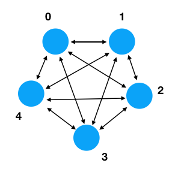

# Project 2 - The Raft Network

A typical deployment of Raft might involve 3, 5, or 7 servers.  These servers are fully interconnected with each other in the sense that any server can send a message to any other server.  Thus, the network topology looks something like this:



Your task is to encapsulate the Raft network in some kind of higher-level object that hides a lot of the transport details. For example, maybe you'll create some object that works like this:

```
>>> from raftnet import RaftNetwork
>>> net = RaftNetwork(0)    # 0 is my address
>>> net.send(1, b'Hello')   # Send b'Hello' to node 1
>>> net.send(2, b'World')   # Send b'World' to node 2
>>> msg = net.receive()     # Receive a message from anyone
```

In another terminal window, you could create a different server and
start interacting:

```
>>> from raftnet import RaftNetwork
>>> net = RaftNetwork(1)
>>> net.receive()
b'Hello'
>>> net.send(0, b'Hey')
>>>
```

In some sense, we're doing a bit of high-level "wishful thinking" here.   We know that Raft requires multiple machines.  We know that those machines communicate on the network by sending messages.   Thus, we need to devise some strategy for driving all of that.  The `RaftNetwork` object above is that.   You don't necessarily need to follow the same programming interface, but you need to devise *something*.  

## Technical Requirements

The networking layer of Raft has some critical properties that need to be observed in order to make the algorithm reliable. Some of these properties are going to seem quite subtle now. 

1. Sending a message is **always** instant and asynchronous.  That is, the `send()` operation never waits for a message to be delivered to the receiver.  Sending a message is like dropping a letter in the mailbox at the post office.  Once you've done it, you walk away.  How and when the message gets delivered is not your problem. 

2. Message delivery does not have to be reliable.  If you send a message, there is no guarantee that it gets delivered. The destination server could be crashed or the network broken in some manner.  Again, it's like putting a letter in
the mailbox.  Once you've dropped it off, you have no control over what happens to it.   Your implementation of `RaftNetwork` can liberally use this assumption.  For example, if you send a message and encounter a network error, just throw the message away. Or, if the receiver's mailbox is completely filled up with unread messages, you could just take all of them and throw them in the trash.  Oh well.

3. Messages can be received from any server at any time and in any order.  Thus, the `receive()` operation should just return any message regardless of where it came from.  If it's important to know the sender, then the sender should include their return address in the message itself.  Again, it's like the post office.

4. No waiting for slow-pokes. There is a chance that sending a message to a server could be working, but taking an extra long time (i.e., slow network).  Your networking layer needs to ensure that slow connections do NOT block progress on everything else.  This relates to point 1 above. The `send()` operation is always instant and asynchronous.  If message delivery is slow for one server, that's not our concern.  Perhaps it's still fast for all of the other servers.

Some of these points may seem counterintuitive at first--especially those about unreliable networking.  However, the Raft algorithm is designed to work with this.  Thus, it is ok for you to write code that throws messages away or deals with errors in some kind of "harsh" manner. This runs counter to what we are often taught as programmers. You might be inclined to report some kind of nice error when it doesn't work. NO. Just silently throw the message out and forget about it (well, you could log it perhaps).  

## How to Proceed

First, there is the technical problem of configuring the network.  I suggest making a file that maps server numbers to actual network addresses.  For the rest of the Raft implementation, you will use the server numbers.

```
# raftconfig.py

servers = {
  0 : ('localhost', 15000),
  1 : ('localhost', 15001),
  2 : ('localhost', 15002),
  3 : ('localhost', 15003),
  4 : ('localhost', 15004)
}
```

Each server needs to have a unique address and port combination. For the project, you can put everything on `localhost`.  However, in a real deployment of Raft, servers would typically be separate machines.  We're not really focused on deployment though.  So, just hardcode the addresses in a dictionary as shown.

Second, there is a problem in establishing network connections.   Every server needs to connect with every other server.  Moreover, the servers need to account for the fact that servers can die. So, at any given time, one of the links could be inactive or dead.   Plus, to make a connection, one end of the connection needs to be accepting as a "server" (that is, using the `sock.accept()` call).  The other end need to act as a "client" (using the `sock.connect()` call).  The host/port combinations in `raftconfig.py` are the connection points used for listening/accepting incoming connections on each server.

Recognize that there is a lot of inherent concurrency involved in the network.  For example, consider the `receive()` method.  That's supposed to receive a message from anyone. This implies that the network needs to be listening to multiple sockets simultaneously.  This implies that you need to be using threads or some other concurrency mechanism. One tool that can help are queues.  For example, you might structure the `receive()` operation around a queue like this:

```
import queue

class RaftNetwork:
    def __init__(self):
        self._inbox = queue.Queue()

    def receive(self):
        return self._inbox.get()
```

Elsewhere, you would have bits of code that read from sockets and drop messages on the queue:

```
...
while True:
     msg = transport.receive_message(sock)
     self._inbox.put(msg)
...
```

Again, this requires concurrent execution.  Each server can receive messages from multiple clients at the same time.

Queues may be useful elsewhere.  For example, one way to implement an "instant send" is to drop the message on a queue and let some kind of background thread do the actual sending.    

## Considerations for Testing

The Raft network is a critical component of the whole project.  However, one challenge concerns testing.  For example, how do you actually test the implementation of the network without just running it?   Is it something that can be easily unit-tested?   Can it be mocked in some way?  And, even if you can test it, what kinds of tests would you perform?   Clearly, you have to be able to send/receive messages, but some of the other requirements about timing, unreliable message delivery, and other things are a bit more difficult to test.

With this in mind, I have a few ideas.   One is to make the `RaftNetwork` object something that can be instrumented with some simulated failure controls. For example, could you simulate a dead network link with some kind of control method?

```
net = RaftNetwork(0)
net.disable(2)          # Disable communication with server 2
...
net.enable(2)           # Enable communication with server 2
```

Or, could you have a method to make one of the links extremely slow?   I don't know if this would be useful or not, but testing the full Raft algorithm later becomes quite complicated.   It might be useful to have the ability to "turn dials" to do things with the network such as simulate dead machines, bad connections, and other things.

Another general thought is to make the API you choose for the network something that could be easily mocked or faked later on.  For example, to test certain parts of Raft, it might be useful to supply a "fake network", execute some kind of operation, and then watch what happens on the fake network.

