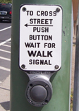
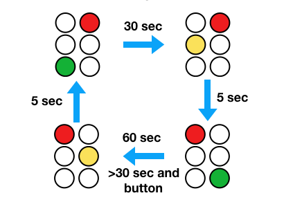

# The Traffic Light

You have been been tasked with writing the control software for a simple traffic light.  So, let's think about traffic lights for a moment.  First, there is the light itself:


It shows a different color in each direction.  For this exercise, let's assume that there are just two directions (e.g., NORTH-SOUTH, and EAST-WEST).   A traffic light might also have a pedestrian push button.  For example:



We'll assume that there is just one such button for this light.  Perhaps one of the directions is a very busy road with a long signal time. Pressing the button shortens the light cycle in that direction only.

## A Traffic Signal as State Machine

A traffic light is a simple example of a state machine.  First, traffic lights operate through a continuous cycle of timed operation wherein the lights change colors. The "state" is the current output of the lights.  Inputs such as push buttons act as events that might alter the cycle.   Here's an example of a possible state cycle:



In this diagram, the cycle shows green for 30 seconds in one direction and 60 seconds in the other.  Yellow lights always show for 5 seconds as the light changes.  A pedestrian push-button can shorten the 60-second light, but that light must still show green for at least 30 seconds before changing (i.e., pressing the button won't cause the light to instantly change if it just became green). 

## Some Light-Building Components

Suppose that you're given a collection of pre-built components for constructing a traffic light including a light display module and a push button module.  And for some reason, suppose that all of these were internet-enabled and written in Python (okay, a really bad idea, but work with me).

In the directory `exercises/traffic` you'll find a file `light.py`.  This is a UDP-controlled light module.  In a separate terminal window, run it:

```
bash $ python exercises/traffic/light.py "Light1" 10000
Light1: R
```

Now, in a completely separate window, open up an interactive Python session and send it some messages to change the light color:

```
>>> from socket import socket, AF_INET, SOCK_DGRAM
>>> sock = socket(AF_INET, SOCK_DGRAM)
>>> sock.sendto(b'G', ('localhost', 10000))
>>>
```

You should see the output of the light change.  Try sending messages such as `b'R'`, `b'Y'`, `b'G'`.  That's about all there is to a light. If you want multiple lights, run more copies of the `light.py` program in different terminal windows using different port numbers.

The file `button.py` has code for a push button.  Run it in a separate terminal window:

```
bash $ python exercises/traffic/button.py localhost 15000
Button: [Press Return]
```

Try pressing `return` a few times.  Okay, very exciting.  The button program sends a message to a host/port address of your choosing.  Open a Python session in a different terminal window and receive the messages:

```
>>> from socket import socket, AF_INET, SOCK_DGRAM
>>> sock = socket(AF_INET, SOCK_DGRAM)
>>> sock.bind(('',15000))
>>> while True:
...      msg, addr = sock.recvfrom(1024)
...      print("You pressed it!")
...
```

With this running, go to the window with the `button.py` program and press return.  You should now see the "You pressed it!" message being displayed in the other terminal.

## Your Task

Your task is to write the state machine control software for the traffic light described in this problem. Specifically, here's the light configuration:

1. A single East-West light
2. A single North-South light
3. A single push button to change the North-South light to red.

Here are the behaviors that need to be encoded in your controller:

1.  The East-West light stays green for 30 seconds.
2.  The North-South light stays green for 60 seconds. 
3.  Yellow lights always last 5 seconds.
4.  The push-button causes the North-South light to change immediately if it has been green for more than 30 seconds.  If less than 30 seconds have elapsed, the light will change once it has been green for 30 seconds.

## How to Proceed

To solve this problem, it first helps to understand that there are number of things happening concurrently.  First, there is time evolution.  So, somehow your controller needs to keep an internal clock to manage light cycle times.  Second, there are incoming events (the button press).  So, the controller also needs to monitor that.

The configuration of the whole system is rather complicated.  For example, you'll have two `light.py` programs and a `button.py` program running at the same time as your controller when in operation.  This makes testing and debugging all the more challenging.  In fact, it might be challenging just to put everything together in your IDE or terminal as you'll need to be running at least 4 programs at once.   Figuring out how to manage this complexity is part of the exercise.

## How this pertains to Raft

A typical Raft configuration consists of five independently running servers, operating according to a state machine and responding to events (messages, timers, etc.).  The techniques that you figure out for the traffic light will be applicable 
 